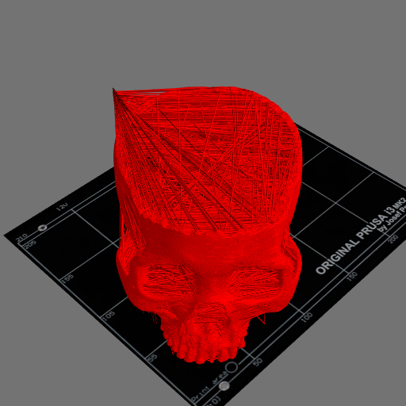
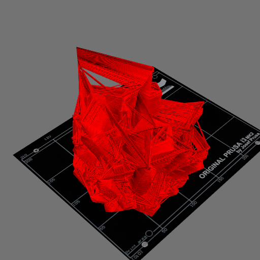
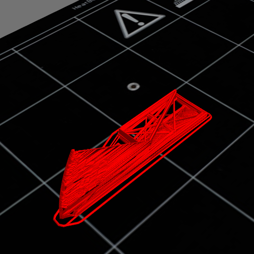
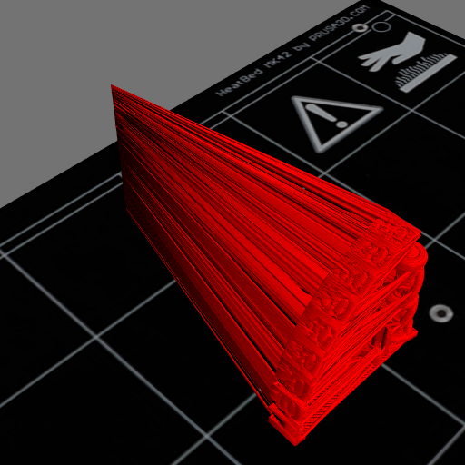

# gcode2png

python3 script for 3D rendering gcode files with [Mayavi](https://docs.enthought.com/mayavi/mayavi/)

## Features

- `--help` is showing usage
- different options to show bed, model  + moves + supports
- auto adjust camera based on the model dimensions and location
- option to define output image resolution
- option to show image preview (no more weird unrendered windows)
- set env var `LOGLEVEL=DEBUG` to see log flood on stderr
- python 3.10+

## Known limitations

- python 3.10+
- tested under Ubuntu 22.04, and nothing else
- no longer compatible with forked projects
- some gcode files are rendered weird, see `test_nano.gcode`, for example I have
  some custom gcode to trigger photos for timelapse, and thus some renders
  contain those lines that go to the back of the plate and then to the right
  (this is especially visible in skullbowl and crystal examples below)
- no support for bgcode
- no support for absolute moves in gcode

## Examples

Good examples:




Not so great examples:





## Requirements

```shell
pip3 install -r requirements.txt
```

## Usage

```shell
python ./gcode2png.py --help
```

## Develop

```shell
make clean
make -j12 all
make -j12 previews previews_md
```

## Thanks

- initial gcode2png idea forked from [Zst](https://github.com/Zst/gcode2png),
  which was forked from [shodushi](https://github.com/shodushi/gcode2png)
- [gcodeParser.py](https://github.com/jonathanwin/yagv)

## Todo

- add thumbnail generations for Linux
- add install to makefile
